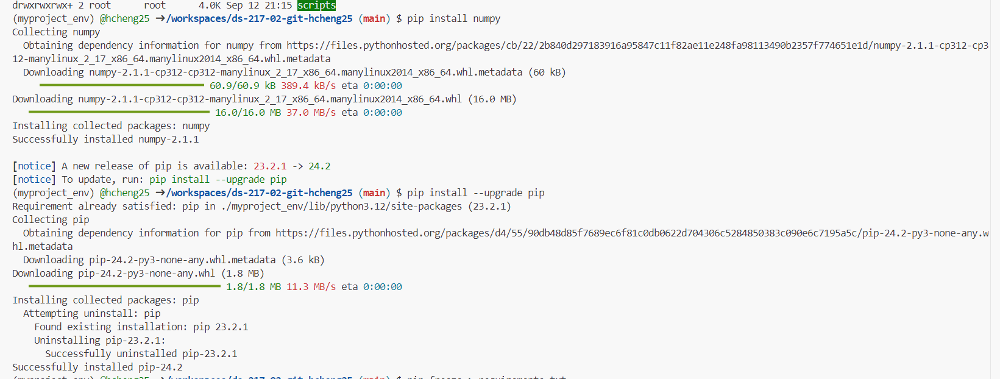

# GitHub Username
hcheng25

# Self Intro
I am a first year Health Data Science MS student taking this course as part of my core classes, and as my background has very little computer science and programming, I am hoping to see more of what Python and programming in general can do to aid my future endeavors into data science and how Python can be applied to public health.

# Problem 4 from Assignment 1
My final total was 233168.
```
# If we list all the natural numbers below 10 that are multiples of 3 or 5, we get (3, 5, 6, 9). The sum of these multiples is 23. Find the sum of all the multiples of 3 or 5 below 1000.
sum = 0
i = 1

for i in range(1000):
    # check if divisible by 5 or 3
    if(i%5 == 0 or i%3 == 0):
        # if divisible without remainder, print number and add to running sum
        print(i)
        sum = sum + i

# print final sum
print(sum)
```

Link to [Python](https://www.python.org/)

# Installing numpy


# Me 95% of the time
